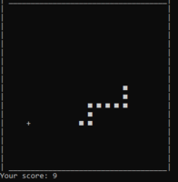

## **Random projects**

Some personal and university projects developed during my graduation of Computer Engineering at UTFPR.

### **VHDL microprocessor - 2020**

A microprocessor made in **VHDL** for the discipline of Computer Architecture. 5th semester.

### **DSatur algorithm - 2019**

An implementation of the DSatur algorithm in 17 lines of **Python** (without imports) for the discipline of Discrete Mathematics. 4th semester.

### **Snake simple artificial intelligence - 2019**

  

A basic neural network + genetic algorithm applied for the game Snake, developed in **JavaScript** with **Brain.js** and **Processing.js**. 3rd semester. Check it out on [Youtube](https://youtu.be/XVqDbadNbw4).

### **2D platform game - 2019**

  

A basic 2D platform game developed in **C++** with **SFML** for the discipline of Objected Oriented Programming during my 2nd semester of graduation. Check it out on [Youtube](https://youtu.be/mhoib4eefD4).

### **Snake on console - 2019**

  

A clone of the game Snake in **C++**, using the terminal console and ASCII characters to render the game. 2nd semester.

### **Elastic collision - 2018**

  

Graphical simulation of elastic collision between balls using **C++** and **SDL2**. Developed as an extra assignment for the discipline of Physics I. Check it out on [Youtube](https://youtu.be/uwxLOZvVvNI).

### **2048 on console - 2018**

  

A clone of the famous game 2048 in **C**, using the terminal console and ASCII characters to render the game. 1st semester.
